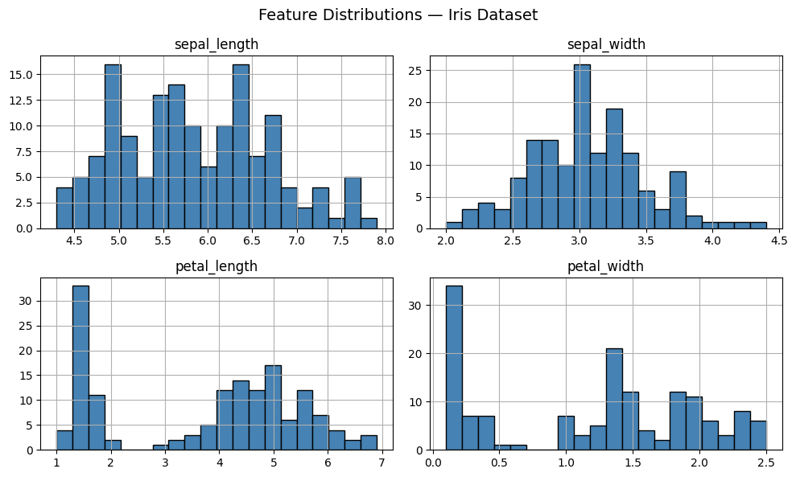
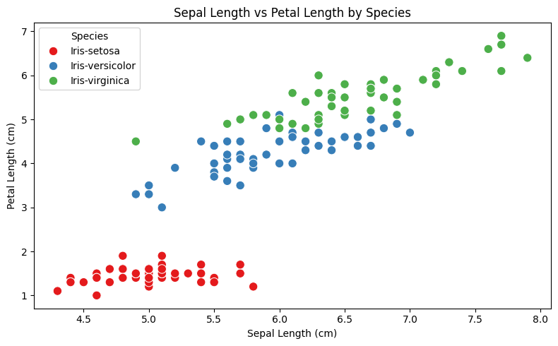
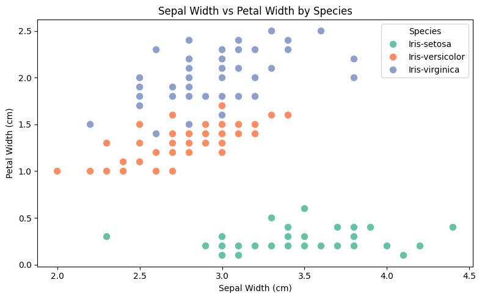
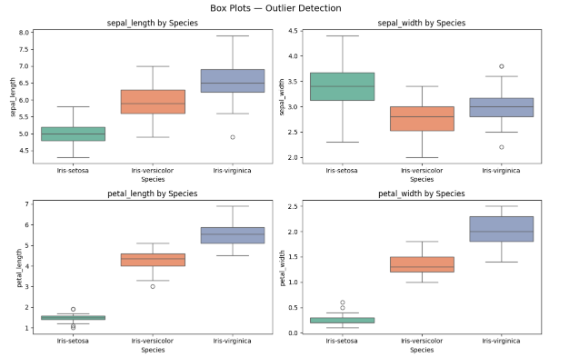

# Exploring-and-Visualizing-Iris-Dataset
 This repository contains AI/ML internship tasks completed at DevelopersHub Corporation, covering data analysis, visualization, and machine learning projects.

 

# Tasks Overview

| Task | Title | Status |
|------|-------|--------|
| Task 1 | Exploring and Visualizing the Iris Dataset |  Complete |
| Task 2 | Predict Future Stock Prices |  Upcoming |
| Task 3 | Heart Disease Prediction |  Upcoming |
| Task 4 | General Health Query Chatbot |  Upcoming |
| Task 5 | Mental Health Support Chatbot |  Upcoming |
| Task 6 | House Price Prediction |  Upcoming |

---

# Task 1: Exploring and Visualizing the Iris Dataset

# Objective
Load, inspect, and visualize the Iris dataset to understand data trends and distributions.

---

# Dataset Information
Name: Iris Dataset  
Rows: 150  
Features: sepal_length, sepal_width, petal_length, petal_width  
Target: species (setosa, versicolor, virginica)  

---

# Tools & Technologies
 Python 3.x  
 Pandas  
 Matplotlib  
 Seaborn  
 Jupyter Notebook  

---

# Steps Performed
Loaded dataset using pandas  
Inspected dataset (shape, columns, head)  
Checked missing values (none found)  
Created scatter plot for feature relationships  
Generated histograms for distribution analysis  
Used box plots for outlier detection  

---

# Visualizations

# Feature Distributions (Histograms)

# Scatter Plot (Sepal Length vs Petal Length)

# Scatter Plot (Sepal width vs Petal width)

# Box Plots (Outlier Detection)

# Key Findings
- Iris-setosa is clearly separable from other species  
- Petal length and petal width are the most important features  
- Minor outliers detected in sepal_width and petal_width  
- Dataset is clean and well-suited for classification tasks  

---

# How to Run

1. Clone the repository:
   
   git clone https://github.com/BilalRajput-52/Exploring-and-Visualizing-Iris-Dataset
.git
   
 # Install dependencies
 
  pip install pandas matplotlib seaborn
  
  # Run the Jupyter Notebook
  
 # Future Work
Apply classification algorithms (Logistic Regression, SVM, KNN)
Perform feature scaling
Evaluate models using accuracy and confusion matrix
 # Author
 Bilal Ahmed
BS-IT Student — KFUEIT
AI/ML Engineering Intern — DevelopersHub Corporation
